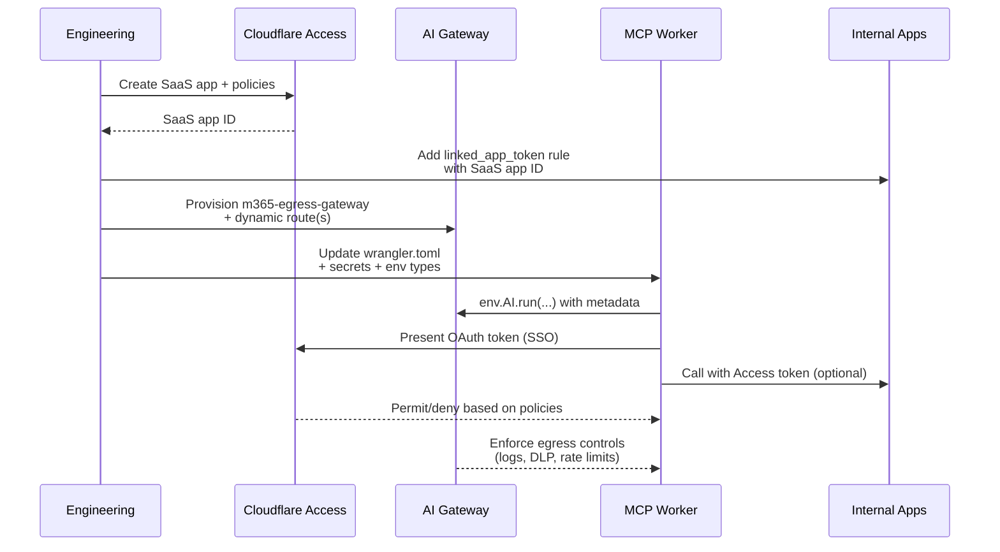

# Operations Playbook – Enterprise Transformation

This guide documents the operational changes required to convert
[m365-mcp-server](https://github.com/nikolanovoselec/m365-mcp-server)
into a production-grade worker protected by Cloudflare Access and governed by
Cloudflare AI Gateway. It supersedes the upstream development-oriented instructions.

## 1. Prerequisites

| Component | Requirement |
| --- | --- |
| Cloudflare Account | Workers, Durable Objects, AI Gateway, and Access enabled |
| Domain | Dedicated hostname (e.g., `mcp.example.com`) managed by Cloudflare |
| Identity Provider | Entra ID, Okta, or other IdP federated with Cloudflare Access |
| Microsoft 365 Tenant | App registration with delegated scopes and admin consent |
| GitHub | Access to both the upstream and production repositories |

### Tooling

- `wrangler` v4.33+ (Workers, DOs, AI Gateway features)
- `npm` / `node` 18+
- Administrative access to rotate secrets in both Cloudflare and Microsoft 365

## 2. Environment & Secrets

All secrets must be stored via Cloudflare secrets, never inside `wrangler.toml` or the code base.
Run the following for each environment (e.g., `--env production`).

```bash
wrangler secret put MICROSOFT_CLIENT_ID
wrangler secret put MICROSOFT_CLIENT_SECRET
wrangler secret put MICROSOFT_TENANT_ID
wrangler secret put GRAPH_API_VERSION
wrangler secret put ENCRYPTION_KEY
wrangler secret put COOKIE_ENCRYPTION_KEY
wrangler secret put COOKIE_SECRET
wrangler secret put AI_GATEWAY_SERVICE_TOKEN   # if using service-token policies
```

`wrangler.toml` now ships with placeholders for account, AI Gateway, KV IDs, and the production domain alongside the required `[[ai]]` binding. Replace each value before deployment and rely on `wrangler secret put` for every sensitive field (including `GRAPH_API_VERSION`).

## 3. Migration Phases



### Phase 1 – Establish the Security Perimeter

1. Create a **Cloudflare Access** self-hosted application for `mcp.<domain>`.
2. Connect enterprise IdP(s) and configure policies:
   - User policies (SSO + MFA + device posture)
   - Service token policy for automation/CI use cases
3. Validate by browsing to the Worker route; ensure Access blocks unauthenticated traffic.

### Phase 2 – Register the MCP Portal & Linked Apps

1. Add the Worker as an Access for SaaS application (OIDC) following the [Secure MCP servers guide](https://developers.cloudflare.com/cloudflare-one/access-controls/applications/http-apps/mcp-servers/saas-mcp/).
2. Record the SaaS application `id` (API: `GET /client/v4/accounts/:id/access/apps`).
3. For each internal HTTP service the MCP server should call, create or update the Access policy to include a `linked_app_token` rule referencing the SaaS app `id` ([docs](https://developers.cloudflare.com/cloudflare-one/access-controls/applications/http-apps/mcp-servers/linked-apps/)).
4. Update the self-hosted app configuration to require the new policy so tokens issued to the MCP portal are accepted.
5. Expose the MCP portal via **Access → AI Controls → MCP Portals** and associate it with the SaaS app and Access policies.

### Phase 3 – Deploy AI Gateway Control Plane

1. Create an AI Gateway (e.g., `m365-egress-gateway`).
2. Enable logging, caching, rate limiting, and DLP policies as required.
3. Define dynamic routes ([docs](https://developers.cloudflare.com/ai-gateway/features/dynamic-routing/)):
   - `dynamic/microsoft-graph-handler` – proxies Microsoft Graph requests
   - Additional routes for LLM/tooling integrations (optional)
4. (Optional) Issue a gateway service token for worker authentication.

### Phase 4 – Refactor the Worker

1. Update `wrangler.toml`
   - Remove `[vars]` blocks; rely on secrets only
   - Add `[[ai]] binding = "AI"
   - Confirm Durable Object binding (`MCP_OBJECT`) and routes
2. Extend the TypeScript `Env` interface with `AI: Ai`, Access headers (`CF_Access_User`, etc.),
   and required secrets.
3. Replace all `fetch` calls to Microsoft Graph with `env.AI.run(...)`
   ([binding reference](https://developers.cloudflare.com/ai-gateway/integrations/worker-binding-methods/)):

   ```ts
   await env.AI.run(
     "dynamic/microsoft-graph-handler",
     {
       method: "GET",
       headers: { Authorization: `Bearer ${token}` },
       path: "/v1.0/me/messages",
     },
      {
        gateway: {
          id: "m365-egress-gateway",
          metadata: {
            userId,
            mcpTool: "getEmails",
            requestId,
            userEmail: env.CF_Access_Authenticated_User_Email ?? props?.mail,
          },
        },
      },
    );
   ```

4. Centralise error handling around `env.AI.run` responses to translate gateway errors
   into MCP-friendly responses.
5. Optionally capture `env.AI.aiGatewayLogId` for correlation with gateway telemetry.
6. Ensure tokens and secrets are always sourced from `env`, not imported constants.

### Phase 5 – Deploy

1. `npm install && npm run validate`
2. `wrangler deploy --env production`
3. Confirm Access headers reach the worker if you intend to log authenticated identities.

### Phase 6 – Validation Checklist

- [ ] Access prompt enforced (SSO + MFA + device posture)
- [ ] OAuth 2.1 flow completes; Microsoft consent screen appears
- [ ] Tools (`sendEmail`, `getEmails`, etc.) succeed via AI Gateway
- [ ] AI Gateway dashboards contain traffic with metadata (`userId`, `mcpTool`, `userEmail`)
- [ ] Access and Workers logs show consistent request IDs/correlation IDs
- [ ] Durable Object logs include `aiGatewayLogId` entries that match AI Gateway analytics for each tool call
- [ ] Durable Object state persists across tool calls

## 4. Maintenance Procedures

- **Secret Rotation** – Update Cloudflare secrets and redeploy. Rotate Microsoft app secrets in Entra ID.
- **Policy Updates** – Adjust Access / AI Gateway policies when onboarding new groups or changes in DLP rules.
- **Monitoring** – Review AI Gateway analytics, Workers tail logs, and Access audit history after major releases.
- **Incident Response** – If credentials leak, revoke the Microsoft client secret, reset Cloudflare secrets,
  invalidate Access tokens, and review AI Gateway logs to scope exposure.

## 5. Release Checklist

1. Sync upstream `m365-mcp-server` changes and reapply production patches.
2. Run `npm run validate`.
3. Execute integration tests (Access → OAuth → Graph).
4. Update documentation in this repository when the transformation steps change.
5. Tag the release in GitHub and document the deployment window.

---

For implementation specifics (tool schemas, protocol nuances), continue to rely on the upstream
[m365-mcp-server documentation](https://github.com/nikolanovoselec/m365-mcp-server#readme).
