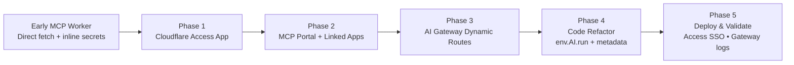

# Production Transformation Guide for Microsoft 365 MCP Server

This repository captures the hardened deployment of the open-source [m365-mcp-server](https://github.com/nikolanovoselec/m365-mcp-server) project.
The objective is to evolve the experimental Cloudflare Worker into an enterprise-grade agent with
clear ingress controls, governed egress, and auditable operations.

> Looking for feature-level behaviour, tool definitions, or local development instructions?
> See the upstream repository documentation:
> - [README](https://github.com/nikolanovoselec/m365-mcp-server/blob/main/README.md)
> - [OPERATIONS](https://github.com/nikolanovoselec/m365-mcp-server/blob/main/OPERATIONS.md)
> - [TECHNICAL](https://github.com/nikolanovoselec/m365-mcp-server/blob/main/TECHNICAL.md)

## Scope

- **Source code** mirrors the upstream worker while introducing AI Gateway bindings,
  hardened environment typings, and security-centric defaults.
- **Documentation** in this repository focuses exclusively on production-readiness
  and the transformation steps required to land inside a secured Cloudflare estate.
- **Operations** material provides deterministic procedures for deployment,
  validation, logging, and change management.

## Security Transformation Goals

1. **Perimeter Enforcement** – Protect the worker with Cloudflare Access
   (SSO, MFA, device posture, service tokens) before any MCP handshake occurs.
2. **Application Authorisation** – Preserve Microsoft OAuth 2.1 + PKCE flows while
   storing secrets exclusively through `wrangler secret`.
3. **Egress Governance** – Route all outbound API calls (Microsoft Graph, LLMs, webhooks)
   through Cloudflare AI Gateway with metadata for logging and policy enforcement.
4. **Operational Guardrails** – Maintain reproducible deployment, observability, and
  incident response checklists suitable for regulated environments.
5. **Auditable Graph Egress** – All Microsoft Graph calls run through Cloudflare AI
  Gateway with enriched metadata (`userId`, `userEmail`, `mcpTool`, `requestId`) and
  expose the gateway log identifier so investigations can pivot between Workers logs
  and gateway analytics.

## Repository Map

- [`OPERATIONS.md`](./OPERATIONS.md) – Phase-by-phase migration playbook, secret strategy,
  validation checklist, and maintenance tasks.
- [`TECHNICAL.md`](./TECHNICAL.md) – Architectural deep dive covering Access, Durable Objects,
  AI Gateway invocation patterns, environment contract, and logging strategy.
- `src/` – Worker source aligned with the hardened environment.
- `wrangler.toml` – Production configuration (AI binding, Durable Object, Access-friendly routes).

## Migration Roadmap

1. **Provision Cloudflare Access** – create a self-hosted application guarding `mcp.<domain>`
   and authorise relevant identities (human + automation).
2. **Deploy AI Gateway** – create `m365-egress-gateway`, enable logging/rate limiting/DLP,
   and define the required dynamic routes (e.g., `dynamic/microsoft-graph-handler`).
3. **Refactor Configuration & Secrets** – bind the gateway via `[[ai]]`, remove `[vars]`,
  populate the placeholder IDs in `wrangler.toml`, and push all credentials using
  `wrangler secret put`.
4. **Update Source Code** – replace direct `fetch` invocations with `env.AI.run(...)`,
   attach `gateway.metadata` (user identifiers, MCP tool name, correlation IDs),
   and centralise error handling for Access or gateway denials.
5. **Deploy & Validate** – run `wrangler deploy --env production`, complete the Access SSO,
   Microsoft consent, and tool execution flow; confirm AI Gateway/Access telemetry.

### Transformation at a Glance

## Reference Material

- Cloudflare docs – [AI Gateway binding methods](https://developers.cloudflare.com/ai-gateway/integrations/worker-binding-methods/)
- Cloudflare docs – [Universal endpoint](https://developers.cloudflare.com/ai-gateway/usage/universal/)
- Cloudflare docs – [Dynamic routing](https://developers.cloudflare.com/ai-gateway/features/dynamic-routing/)
- Cloudflare docs – [Access linked apps for MCP servers](https://developers.cloudflare.com/cloudflare-one/access-controls/applications/http-apps/mcp-servers/linked-apps/)
- Cloudflare GitHub – [AI Gateway MCP server](https://github.com/cloudflare/mcp-server-cloudflare/tree/main/apps/ai-gateway) (log tooling & OAuth patterns)

## Contributing

All feature work, tool enhancements, or general documentation improvements should originate in
[m365-mcp-server](https://github.com/nikolanovoselec/m365-mcp-server). Contributions here should
focus on production-hardening, deployment automation, and operational playbooks. When updating
source code, keep both repositories in sync to ensure transformation guidance remains accurate.
