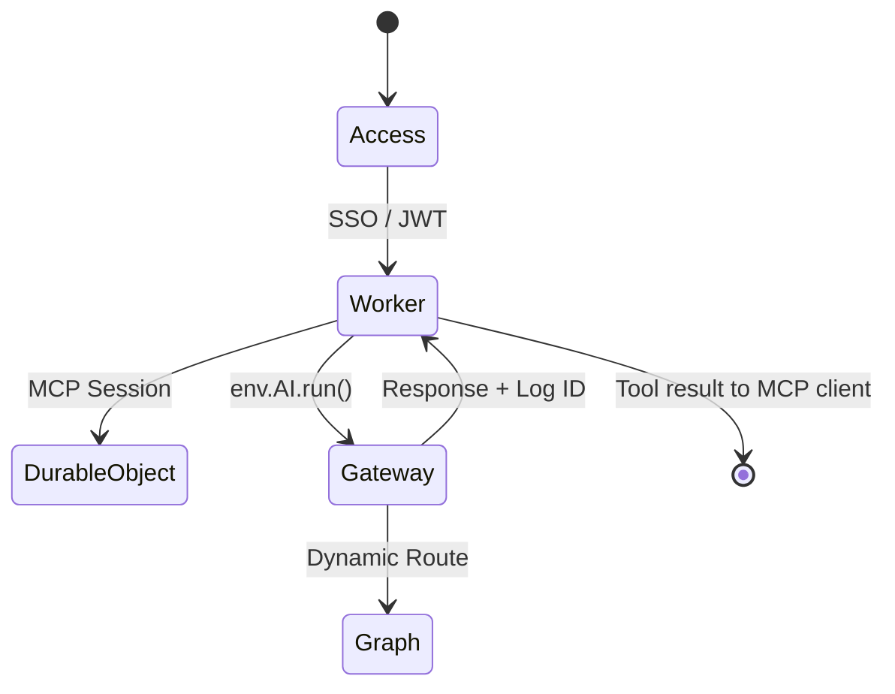

# Technical Reference – Production Transformation

This document complements the upstream
[m365-mcp-server technical guide](https://github.com/nikolanovoselec/m365-mcp-server/blob/main/TECHNICAL.md)
by describing the additional components required to harden the worker
for enterprise use. It focuses on ingress protection, AI Gateway egress,
and the environment contract that binds everything together.

## 1. Architectural Overview

```
Client (MCP) → Cloudflare Access → Worker (/sse) → Durable Object
                                        ↓
                                AI Gateway (m365-egress-gateway)
                                        ↓
                              Microsoft Graph / External APIs
```



1. **Cloudflare Access** acts as checkpoint #1 (perimeter). Requests without a valid Access token never
   reach the Worker. Identity, device posture, and service token claims can be surfaced through headers
   (`CF-Access-Authenticated-User-Email`, `CF-Access-Jwt-Assertion`).
2. **Worker & Durable Object** preserve the MCP protocol behaviours established upstream, including
   Microsoft OAuth 2.1 storage and dual-token props.
3. **AI Gateway** intercepts every outbound call. Dynamic routes encapsulate corporate policies: logging,
   caching, DLP, and rate limiting. Metadata from the Worker identifies the user and MCP tool invoked.

## 2. Environment Contract

```ts
export interface Env {
  MICROSOFT_CLIENT_ID: string;
  MICROSOFT_TENANT_ID: string;
  GRAPH_API_VERSION: string;
  MICROSOFT_CLIENT_SECRET: string;
  ENCRYPTION_KEY: string;
  COOKIE_ENCRYPTION_KEY: string;
  COOKIE_SECRET: string;

  MCP_OBJECT: DurableObjectNamespace;
  OAUTH_KV: KVNamespace;

  /** Cloudflare AI Gateway binding */
  AI: Ai;

  /** Optional Access headers (surfaces identity + posture) */
  CF_Access_Jwt_Assertion?: string;
  CF_Access_Authenticated_User_Email?: string;
  CF_Access_Authenticated_User_Id?: string;
}
```

**Key differences vs upstream:**
- Secrets are not expressed in `[vars]`; they must be supplied via `wrangler secret`.
- The `AI` binding is mandatory when deploying to the hardened environment.
- Access headers are optional, but logging them enables correlation between SSO identities
  and Microsoft OAuth users.

## 3. AI Gateway Invocation Pattern

### Dynamic Route Definition

Create a dynamic route named `dynamic/microsoft-graph-handler` in the AI Gateway UI. Configure it to
forward requests to `https://graph.microsoft.com`. Additional routes (e.g., `dynamic/llm-summarizer`)
can proxy other downstream systems.

### Worker Usage

```ts
const response = await env.AI.run(
  "dynamic/microsoft-graph-handler",
  {
    method: "POST",
    path: "/v1.0/me/sendMail",
    headers: {
      Authorization: `Bearer ${microsoftAccessToken}`,
      "Content-Type": "application/json",
    },
    body: JSON.stringify(payload),
  },
  {
    gateway: {
      id: "m365-egress-gateway",
      metadata: {
        userId: this.props?.id ?? "unknown",
        mcpTool: "sendEmail",
        requestId,
        userEmail: env.CF_Access_Authenticated_User_Email ?? this.props?.mail,
      },
    },
  },
);
```

- **`path`**: Relative to Microsoft Graph base URL, allowing the gateway to centralise origin logic.
- **Metadata**: Supply user identifier, MCP tool name, and correlation IDs so that gateway logs
  support incident response and analytics.
- **Gateway helpers**: Capture `env.AI.aiGatewayLogId` for the most recent call or invoke
  `env.AI.gateway("m365-egress-gateway").patchLog(...)` / `getLog(...)` when you need to append
  metadata or fetch request bodies ([binding methods](https://developers.cloudflare.com/ai-gateway/integrations/worker-binding-methods/)).
- **Error Handling**: The worker should translate non-2xx responses into structured MCP errors,
  indicating whether the issue is policy (429/DLP) vs Graph-specific (403/401).

## 4. Access Awareness

Cloudflare Access for SaaS issues the OAuth token that the worker presents on each request. If the worker later needs to call internal HTTP applications, configure `linked_app_token` policies so the same token is honoured downstream ([docs](https://developers.cloudflare.com/cloudflare-one/access-controls/applications/http-apps/mcp-servers/linked-apps/)).

The worker can read Access-derived headers to enrich logs or enforce additional checks, for example:

```ts
const userEmail = env.CF_Access_Authenticated_User_Email;
if (userEmail) {
  console.log(`Access-authenticated user: ${userEmail}`);
}
```

This data can be injected into the AI Gateway metadata payload for end-to-end traceability.

## 5. Durable Object Considerations

- Discovery mode continues to run without OAuth props; Access ensures only authorised clients
  reach this stage.
- Authenticated tool executions inherit both Access context (perimeter) and Microsoft OAuth tokens
  (application). Ensure Durable Object logs do not emit sensitive tokens; rely on metadata instead.

## 6. Logging & Observability

- **AI Gateway**: Primary location for monitoring outbound traffic, rate limiting, and DLP violations.
  - Dynamic routes expose provider/model decisions and quotas ([docs](https://developers.cloudflare.com/ai-gateway/features/dynamic-routing/)).
- **Workers Tail**: Use `wrangler tail --metadata` to surface request IDs and Access identity info.
- **Access Audit Logs**: Provide authentication history, device posture evaluation, and policy results.
- **Microsoft Entra ID**: Audit application sign-ins to confirm OAuth flows remain compliant.

## 7. Security Checklist

1. Access required and MFA enforced before reaching `/sse`.
2. Secrets only exist within Cloudflare secret storage.
3. AI Gateway metadata consistently labels requests (`userId`, `mcpTool`, `requestId`, `userEmail` when available).
4. Logs contain no raw OAuth tokens or Microsoft responses beyond what is necessary.
5. Deployment scripts run `npm run validate` to preserve lint/format/type safety.

---

For core MCP protocol behaviour, tool schemas, and base architecture, continue to reference the upstream
[m365-mcp-server documentation](https://github.com/nikolanovoselec/m365-mcp-server/blob/main/TECHNICAL.md).
